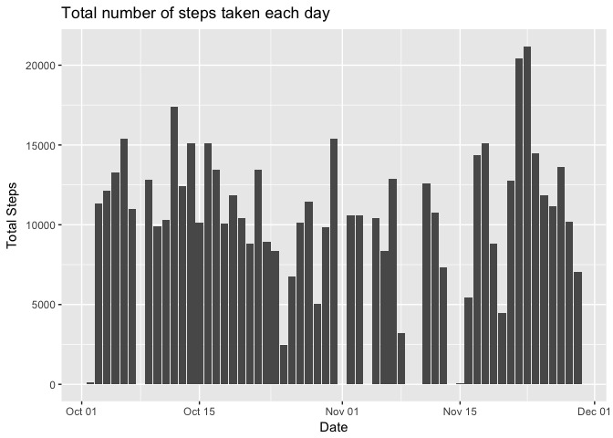
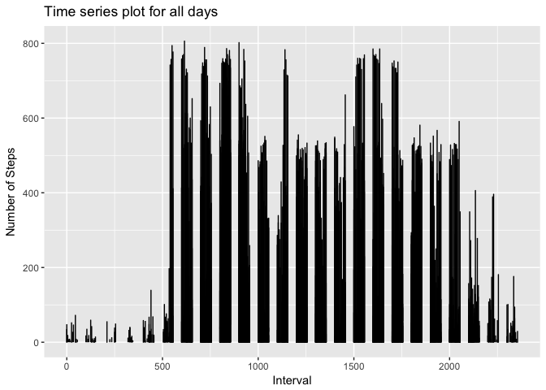
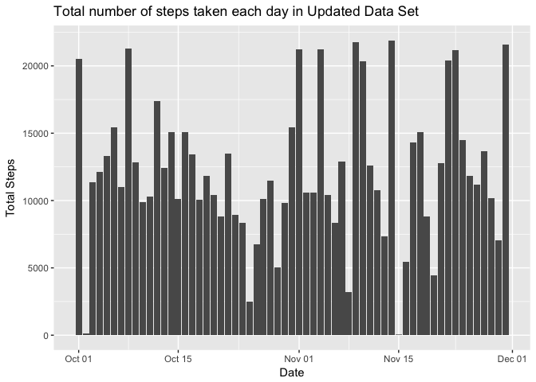
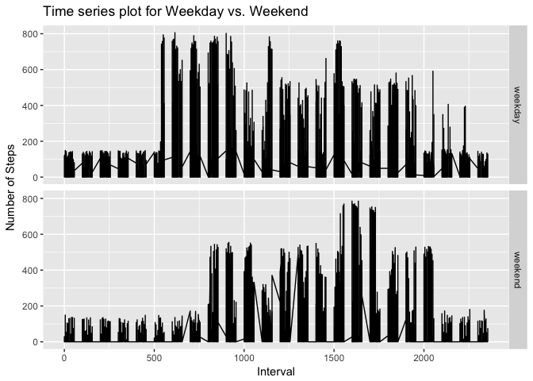

## Loading and preprocessing the data


```r
activity <- read.table("activity.csv", header = TRUE, sep = ",", 
                       na.strings = "NA", stringsAsFactors = FALSE)
activity$date <- as.Date(activity$date)

str(activity)
```

```
## 'data.frame':	17568 obs. of  3 variables:
##  $ steps   : int  NA NA NA NA NA NA NA NA NA NA ...
##  $ date    : Date, format: "2012-10-01" "2012-10-01" ...
##  $ interval: int  0 5 10 15 20 25 30 35 40 45 ...
```

## What is mean total number of steps taken per day?


```r
g <- ggplot2::ggplot(data = activity, ggplot2::aes(date, steps)) 
g <- g + ggplot2::stat_summary(fun.y = sum, geom = "bar", na.rm = TRUE)
g <- g + ggplot2::xlab("Date") + ggplot2::ylab("Total Steps")
g + ggplot2::ggtitle("Total number of steps taken each day")
```

<!-- -->


```r
per.day <- dplyr::summarise(dplyr::group_by(activity, date), 
                            total.steps = sum(steps, na.rm = T))
mean.steps <- round(mean(per.day$total.steps))
median.steps <- median(per.day$total.steps)
```

The **mean** total number of steps taken per day is 9354.

The **median** total number of steps taken per day is 10395.

## What is the average daily activity pattern?


```r
g <- ggplot2::ggplot(activity, ggplot2::aes(x = interval, y = steps))
g <- g + ggplot2::geom_line()
g <- g + ggplot2::xlab("Interval") + ggplot2::ylab("Number of Steps")
g + ggplot2::ggtitle("Time series plot for all days")
```

```
## Warning: Removed 2 rows containing missing values (geom_path).
```

<!-- -->


```r
ind <- which(activity$steps == max(activity$steps, na.rm = TRUE))
itv <- activity$interval[ind]
```

Maximum number of steps at the 615-th interval.

## Imputing missing values


```r
na.total <- summary(activity$steps)[[7]]
```

There are 2304 missing values in the data set.


```r
filled.activity <- activity

n <- length(activity$steps[is.na(activity$steps)])
mean.steps <- mean(activity$steps, na.rm = T)
sd.steps <- sd(activity$steps, na.rm = T)
values <- round(runif(n, min = 0, max = round(mean.steps + sd.steps)))

filled.activity$steps[is.na(filled.activity$steps)] = values

head(filled.activity)
```

```
##   steps       date interval
## 1   113 2012-10-01        0
## 2   128 2012-10-01        5
## 3   142 2012-10-01       10
## 4    19 2012-10-01       15
## 5    92 2012-10-01       20
## 6    46 2012-10-01       25
```

All of the missing values in the data set will be replaced with integer values randomly generated 
between 0 and 149 (sum of mean and standard deviation of number of steps per day)


```r
g <- ggplot2::ggplot(data = filled.activity, ggplot2::aes(date, steps)) 
g <- g + ggplot2::stat_summary(fun.y = sum, geom = "bar")
g <- g + ggplot2::xlab("Date") + ggplot2::ylab("Total Steps")
g + ggplot2::ggtitle("Total number of steps taken each day in Updated Data Set")
```

<!-- -->


```r
new.per.day <- dplyr::summarise(dplyr::group_by(filled.activity, date),
                                total.steps = sum(steps))
new.mean.steps <- round(mean(new.per.day$total.steps))
new.median.steps <- median(new.per.day$total.steps)
```

The **mean** total number of steps taken per day is 12138.

The **median** total number of steps taken per day is 11458.

The new values are slightly diffrent with the previous values since number of NA in the data set is arround 10%.
The impact of imputing missing data have a small effect on the estimates of the total daily number of steps.

## Are there differences in activity patterns between weekdays and weekends?


```r
filled.activity$type <- "weekday"
filled.activity$type[weekdays(filled.activity$date) %in% c("Saturday", "Sunday")] <- "weekend"

head(filled.activity)
```

```
##   steps       date interval    type
## 1   113 2012-10-01        0 weekday
## 2   128 2012-10-01        5 weekday
## 3   142 2012-10-01       10 weekday
## 4    19 2012-10-01       15 weekday
## 5    92 2012-10-01       20 weekday
## 6    46 2012-10-01       25 weekday
```


```r
g <- ggplot2::ggplot(filled.activity, ggplot2::aes(x = interval, y = steps))
g <- g + ggplot2::geom_line() + ggplot2::facet_grid(type ~ .)
g <- g + ggplot2::xlab("Interval") + ggplot2::ylab("Number of Steps")
g + ggplot2::ggtitle("Time series plot for Weekday vs. Weekend")
```

<!-- -->
