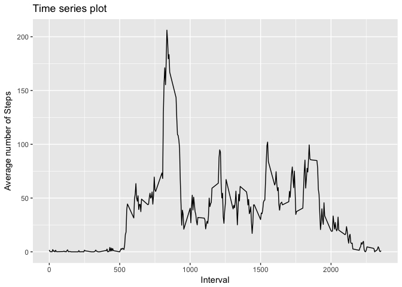
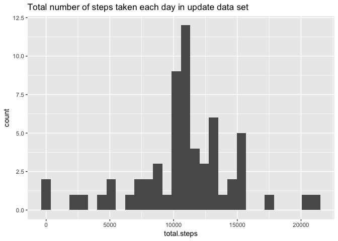
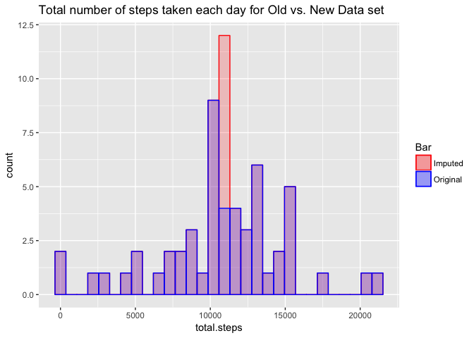
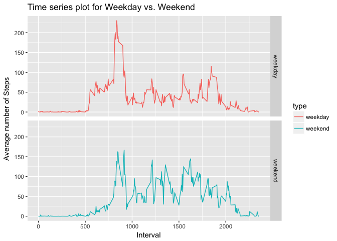

## Loading and preprocessing the data


```r
library(dplyr)
```

```
## 
## Attaching package: 'dplyr'
```

```
## The following objects are masked from 'package:stats':
## 
##     filter, lag
```

```
## The following objects are masked from 'package:base':
## 
##     intersect, setdiff, setequal, union
```

```r
library(ggplot2)

activity <- read.table("activity.csv", header = TRUE, sep = ",", 
                       na.strings = "NA", stringsAsFactors = FALSE)
activity$date <- as.Date(activity$date)

total.steps.per.day <- summarise(group_by(activity, date), 
                                        total.steps = sum(steps))

str(activity)
```

```
## 'data.frame':	17568 obs. of  3 variables:
##  $ steps   : int  NA NA NA NA NA NA NA NA NA NA ...
##  $ date    : Date, format: "2012-10-01" "2012-10-01" ...
##  $ interval: int  0 5 10 15 20 25 30 35 40 45 ...
```

## What is mean total number of steps taken per day?


```r
g <- ggplot(data = total.steps.per.day, aes(total.steps)) 
g <- g + geom_histogram()
g + ggtitle("Total number of steps taken each day")
```

```
## `stat_bin()` using `bins = 30`. Pick better value with `binwidth`.
```

```
## Warning: Removed 8 rows containing non-finite values (stat_bin).
```

<!-- -->

The **mean** total number of steps taken per day:


```r
mean(total.steps.per.day$total.steps, na.rm = TRUE)
```

```
## [1] 10766.19
```

The **median** total number of steps taken per day:


```r
median(total.steps.per.day$total.steps, na.rm = TRUE)
```

```
## [1] 10765
```

## What is the average daily activity pattern?


```r
average.steps <- summarise(group_by(activity, interval),
                                  average = mean(steps, na.rm = TRUE))

g <- ggplot(average.steps, aes(x = interval, y = average))
g <- g + geom_line()
g <- g + xlab("Interval") + ylab("Average number of Steps")
g + ggtitle("Time series plot")
```

<!-- -->


```r
ind <- which(average.steps$average == max(average.steps$average, na.rm = TRUE))
itv <- average.steps$interval[ind]
```

Maximum number of steps at the 835-th interval.

## Imputing missing values


```r
summary(activity$steps)
```

```
##    Min. 1st Qu.  Median    Mean 3rd Qu.    Max.    NA's 
##    0.00    0.00    0.00   37.38   12.00  806.00    2304
```

There are 2304 missing values in the data set.


```r
filled.activity <- activity

na.indices <- which(is.na(filled.activity$steps))
na.intervals <- filled.activity$interval[na.indices]

temp <- sapply(na.intervals, 
               function(iterv) {
                       average.steps[average.steps$interval == iterv, "average"]
                       })


filled.activity$steps[na.indices] <- round(unlist(cbind(temp)))
```

Use an integer value (approximated to the mean for that 5-minute interval) to impute missing values.


```r
updated.total.steps.per.day <- summarise(group_by(filled.activity, date), 
                                                total.steps = sum(steps))

g <- ggplot(data = updated.total.steps.per.day, aes(total.steps)) 
g <- g + geom_histogram()
g + ggtitle("Total number of steps taken each day in update data set")
```

```
## `stat_bin()` using `bins = 30`. Pick better value with `binwidth`.
```

<!-- -->

Updated **mean** total number of steps taken per day:


```r
mean(updated.total.steps.per.day$total.steps, na.rm = TRUE)
```

```
## [1] 10765.64
```


Updated **median** total number of steps taken per day:


```r
median(updated.total.steps.per.day$total.steps, na.rm = TRUE)
```

```
## [1] 10762
```

The previous part, the histogram without imputing missing values


```r
g <- ggplot(data = total.steps.per.day, aes(total.steps)) 
g <- g + geom_histogram()
g + ggtitle("Total number of steps taken each day")
```

```
## `stat_bin()` using `bins = 30`. Pick better value with `binwidth`.
```

```
## Warning: Removed 8 rows containing non-finite values (stat_bin).
```

<!-- -->

The impact of imputing missing data can effectively make the estimates of the total daily number of steps since the mean and median are approximated to the old one, as show as in the two histograms.

## Are there differences in activity patterns between weekdays and weekends?


```r
filled.activity$type <- "weekday"
filled.activity$type[weekdays(filled.activity$date) %in% c("Saturday", "Sunday")] <- "weekend"

head(filled.activity)
```

```
##   steps       date interval    type
## 1     2 2012-10-01        0 weekday
## 2     0 2012-10-01        5 weekday
## 3     0 2012-10-01       10 weekday
## 4     0 2012-10-01       15 weekday
## 5     0 2012-10-01       20 weekday
## 6     2 2012-10-01       25 weekday
```


```r
updated.average.steps <- summarise(group_by(filled.activity, interval, type),
                                          average = mean(steps))

g <- ggplot(updated.average.steps, aes(x = interval, y = average))
g <- g + geom_line(aes(col = type)) + facet_grid(type ~ .)
g <- g + xlab("Interval") + ylab("Average number of Steps")
g + ggtitle("Time series plot for Weekday vs. Weekend")
```

<!-- -->
